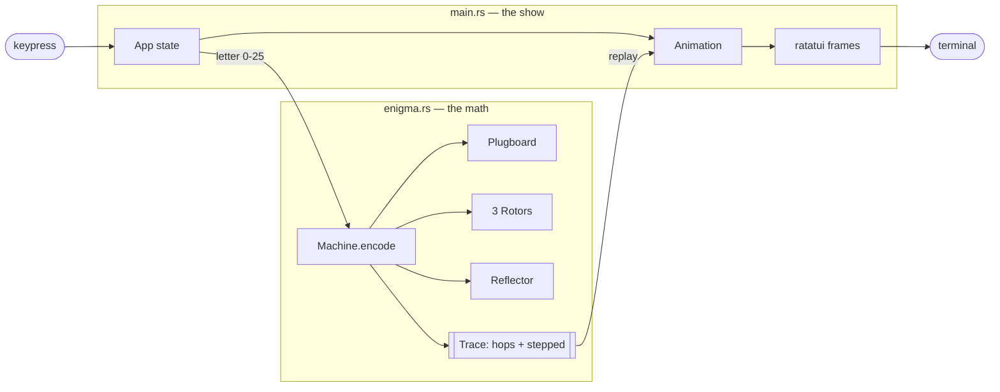
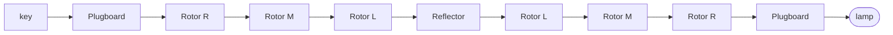
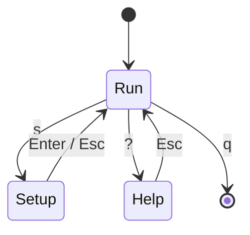

# Enigmascope

A terminal visualizer for the WWII German Enigma machine, built with
[ratatui](https://ratatui.rs). Type a letter and watch the current thread its
way through the plugboard, three rotors, the reflector, and back out to light a
lamp — with the rotors clicking forward exactly the way the real machine did,
double-step quirk and all.

```
cargo run
```

Type `A`–`Z` to encipher. `s` opens setup, `?` opens the in-app explanation,
`r` resets, `q` quits.

---

## A little history

The Enigma was a commercial invention before it was a weapon. The German
engineer **Arthur Scherbius** patented a rotor cipher machine in 1918 and sold
it commercially through the 1920s. The German military adopted and hardened it,
and by the 1930s the **Wehrmacht Enigma I** — the model this project simulates —
was standard: three rotors chosen from a set, a reflector, and a **plugboard**
(*Steckerbrett*) that the commercial machines never had.

The whole point was a cipher that changed with every single keypress. A simple
substitution cipher (A always becomes Q) falls to letter-frequency analysis in
minutes. The Enigma's rotors advance after every letter, so the substitution is
different each time — press `A` five times and you might get `B D Z G O`. The
number of possible daily settings runs into the quintillions.

It was broken anyway. Polish mathematician **Marian Rejewski**, working for the
Cipher Bureau, reconstructed the machine's wiring in **1932** using
permutation-group theory — a genuinely astonishing feat of pure math against a
device he'd never seen inside. With **Różycki** and **Zygalski** he built early
mechanical aids (the *bomba*). In July 1939, weeks before the invasion, Poland
handed its work to Britain and France. At **Bletchley Park**, **Alan Turing**
and **Gordon Welchman** scaled it up into the British *Bombe* and industrialized
the breaking of Enigma traffic.

The fatal flaw was baked into the hardware, and you can see it in this
visualizer: **no letter can ever encrypt to itself.** That single property
(explained below) gave codebreakers enormous leverage, because a guessed word
(a *crib*) could be slid along the ciphertext and instantly rejected wherever a
letter lined up with itself.

---

## How it encrypts

Follow one keypress. The **signal path** panel in the app animates exactly these
hops:

```
key -> plugboard -> rotor R -> rotor M -> rotor L -> reflector
                                                          |
lamp <- plugboard <- rotor R <- rotor M <- rotor L <------+
```

1. **Plugboard (S).** If the pressed letter is patched to another, they swap.
   `A`↔`M` means pressing `A` enters the rotors as `M`.
2. **Rotors, right to left (R → M → L).** Each rotor is a scrambled wiring of 26
   contacts — a permutation of the alphabet. The signal enters one side and
   leaves a different letter. Because the rotors have *rotated*, which contacts
   line up changes constantly.
3. **Reflector (UKW).** A fixed wiring that pairs letters and sends the signal
   *back* into the rotors on a different path. This is what makes the machine
   turn around instead of passing straight through.
4. **Rotors, left to right (L → M → R).** Back through the same three rotors,
   but in the opposite direction, so each applies its *inverse* wiring.
5. **Plugboard again (S), then the lamp.** One final possible swap, and a bulb
   lights under the output letter.

### Why encrypt and decrypt are the same operation

The reflector makes the whole transformation **reciprocal**. If, with the
machine in a given state, `A` comes out as `G`, then in that same state `G`
comes out as `A`. So there's no separate "decrypt mode": you set a second
machine to the *identical* starting configuration, type the ciphertext, and the
plaintext comes back out. The in-app help demonstrates this, and the code proves
it — `enigma.rs` has a unit test that enciphers a message and deciphers it on a
fresh machine.

### Why no letter maps to itself

The reflector pairs letters and never connects a letter to itself. Since the
signal must come back through the reflector, the input and output of a keypress
can never be the same letter. Historically accurate, and historically fatal.

### The stepping mechanism (and the double step)

Before *each* letter is encrypted, the rotors advance:

- The **right** rotor steps every keypress.
- When a rotor passes its **notch** position, it kicks the rotor to its left.
- The **double step**: because of how the pawls engage, when the *middle* rotor
  sits on its own notch, it advances the left rotor **and steps itself again**
  on the next press. This anomaly means the middle rotor occasionally moves twice
  in quick succession.

This is the detail most simulators get wrong. This one reproduces it, and the
`canonical_vector` test in `enigma.rs` pins it down: rotors I‑II‑III, reflector
B, rings/positions `AAA`, no plugs, twenty-five `A`s must produce exactly
`BDZGOWCXLTKSBTMCDLPBMUQOF`. If the double step were wrong, that string would
break partway through.

---

## What you can tune

Press `s` for the setup screen. These five settings together are the *daily
key* — the shared secret two operators needed to communicate.

| Setting | *German* | What it does |
|---|---|---|
| **Reflector** | *Umkehrwalze* | Choose UKW‑**B** or **C**. Fixes the bounce-back wiring. |
| **Rotor order** | *Walzenlage* | Which of rotors **I–V** sit in the left / middle / right slots. Order matters enormously — the three rotors must be distinct. |
| **Ring setting** | *Ringstellung* | Rotates each rotor's internal wiring relative to its labeled ring. Shifts where the scrambling "sits" without changing which letter shows. |
| **Start position** | *Grundstellung* | The three letters showing in the windows at the start of a message. |
| **Plugboard** | *Steckerbrett* | Up to 10 letter-pair swaps applied before and after the rotors. The single biggest contributor to the key space. |

Change any one of these and the output diverges completely. Set two machines
identically and they decode each other. That's the entire game.

**Ring setting vs. start position** trips people up. The *start position* is
what you *see* (the window letters). The *ring setting* is an internal offset
between the wiring and that visible ring — invisible from outside, but it shifts
the whole cipher. Two machines can show the same window letters and still produce
different output if their rings differ.

---

## Using the app

**Run screen**
- `A`–`Z` — encipher a letter (watch the drums click and the signal flow)
- `s` — open setup
- `?` or `h` — open the how-it-works panel
- `r` — reset rotors to their start positions and clear the tape
- `q` or `Esc` — quit

**Setup screen**
- `↑`/`↓` — move between fields
- `←`/`→` — change the selected field's value
- On the plugboard field: type two letters to pair them (type the pair again to
  unpair); `Backspace` undoes the last pair, `Delete` clears all
- `Enter` — apply and return; `Esc` — cancel

**Help screen**
- `↑`/`↓` — scroll; `Esc` — back

---

## Code layout

Two files, deliberately lean:

- **`src/enigma.rs`** — the pure machine. Rotors, reflector, plugboard, stepping,
  and ring math, with no I/O. Its `encode` returns a `Trace` recording every
  contact-to-contact hop, which is what makes the animation possible. Unit-tested
  against known Enigma vectors.
- **`src/main.rs`** — the ratatui app: the three screens, the eased drum
  animation, and the trace-replay that lights the signal path.

The clean split means the cryptography is verifiable on its own (`cargo test`)
and the UI just visualizes a trace it's handed.

---

## Historical accuracy and limits

Faithfully modeled: rotor wirings **I–V**, their notch positions, reflectors
**B** and **C**, the plugboard, ring settings, and the real double-stepping.

Not modeled (intentionally, to stay simple): the four-rotor naval **M4** Enigma
and its thin reflector, the rewireable **UKW‑D**, and rotors with multiple
notches (VI–VIII). All would be straightforward extensions on top of the same
`Rotor`/`Machine` design.

## Build

Needs a recent Rust toolchain (`ratatui = "0.29"`, which pulls in crossterm).

```
cargo run      # launch the visualizer
cargo test     # verify the machine against known vectors
```

---

## Architecture at a glance

The seam between the two files is the `Trace`: `enigma.rs` computes the full
signal path and hands it over; `main.rs` just replays it.



The path a single letter takes through the machine and back:



The three screens:



## Publishing and exploring the repo

Push it to GitHub:

```bash
git init
git add .
git commit -m "Enigmascope: animated Enigma machine visualizer"
git branch -M main
git remote add origin https://github.com/saedarm/enigmascope.git
git push -u origin main
```

Then get an auto-generated architecture wiki and diagrams for free by swapping
the URL — no install, public repos only:

- **DeepWiki** — full wiki + diagrams + code-aware Q&A:
  `https://deepwiki.com/saedarm/enigmascope`
- **GitDiagram** — one interactive, clickable system diagram:
  `https://gitdiagram.com/saedarm/enigmascope`
